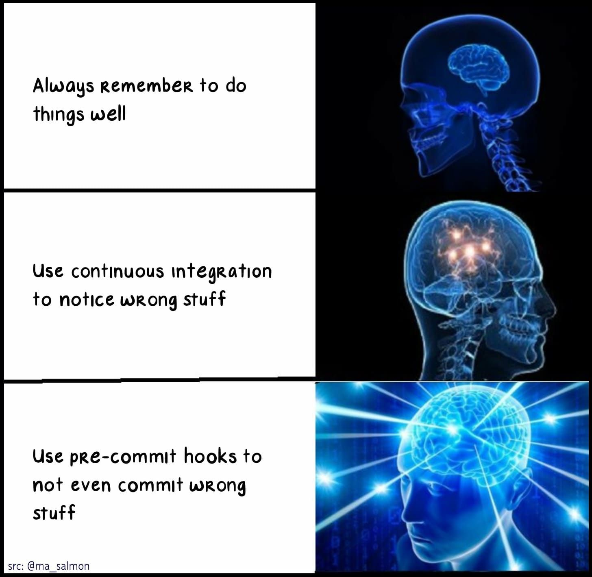

<!-- README.md is generated from README.Rmd. Please edit that file -->

# Useful git pre-commit hooks for R

<!-- badges: start -->

[](https://CRAN.R-project.org/package=precommit)
[](https://lifecycle.r-lib.org/articles/stages.html#experimental)
[](https://github.com/lorenzwalthert/precommit/actions)
<!-- badges: end -->



[Pre-commit hooks](https://pre-commit.com) are tests that run each time
you attempt to commit. If the tests pass, the commit will be made,
otherwise not. A very basic test is to check if the code is parsable,
making sure you have not forgotten a comma, brace or quote.

The goal of this package is to twofold:

-   Provide a [set of
    hooks](https://lorenzwalthert.github.io/precommit/articles/available-hooks.html)
    that are useful when your git repo contains R code.

-   Provide [usethis](https://github.com/r-lib/usethis)-like
    functionality for common tasks such as installation and set-up and
    config file modification.

The following online docs are available:

-   [latest CRAN release](https://lorenzwalthert.github.io/precommit/).

-   [GitHub development
    version](https://lorenzwalthert.github.io/precommit/dev/).

These only cover the functionality added on top of the pre-commit
framework by this package. Everything else is covered in the extensive
[online documentation](https://pre-commit.com) of the pre-commit
framework itself, including how to create hooks for actions like
`git push` or `git checkout`, create local hooks etc.

## Installation

You can install the package from CRAN:

``` r
install.packages("precommit")
```

To access pre-commit functionality from R, you also need to install the
[pre-commit framework](https://pre-commit.com) on which the hook from
this repo build. The following command line methods are tested to work
with this R package (and accessing them from outside R is easier and use
is slightly faster):

-   `$ pip3 install pre-commit --user` (macOS, Linux and Windows)
    **outside** a conda or virtual environment.

-   `$ brew install pre-commit` (macOS).

Alternatively, you can handle the installation from R using
[miniconda](https://docs.conda.io/en/latest/miniconda.html):

-   install miniconda if you don’t have it already:
    `reticulate::install_miniconda()`. This needs reticulate \>= 1.14.

-   install the pre-commit framework with
    `precommit::install_precommit()` into the conda environment
    `r-precommit`. Do not install other packages into this environment.

Then, in a fresh R session:

``` r
# once in every git repo either
# * after cloning a repo that already uses pre-commit or
# * if you want introduce pre-commit to this repo
precommit::use_precommit()
```

The last command initializes pre-commit in your repo and performs some
set-up tasks like creating the config file `.pre-commit-config.yaml`,
where the hooks that will be run on `git commit` are specified. See
`?precommit::use_precommit()` to see how you can use a custom
`.pre-commit-config.yaml` instead of the default at initialization. You
can (obviously) change edit the file manually at any time.

## Usage

The next time you run `git commit`, the hooks listed in your
`.pre-commit-config.yaml` will get executed before the commit. The
helper function `precommit::open_config()` let’s you open and edit the
`.pre-commit-config.yaml` conveniently from the RStudio console. When
any file is changed due to running a hook or the hook script errors, the
commit will fail. You can inspect the changes introduced by the hook and
if satisfied, you can add the changes made by the hook to the index with
`git add path/to/file` and attempt to commit again. Some hooks change
files, like the styler hook, so all you need to do to make the hook pass
is `git add` the changes introduced by the hook. Other hooks, like the
parsable-R hook, will need your action, e.g. add a missing closing brace
to a call like `library(styler`, before they pass at the next attempt.
If all hooks pass, the commit is made. You can also [temporarily disable
hooks](https://pre-commit.com/#temporarily-disabling-hooks). If you
succeed, it should look like this:

<!-- -->

See the hooks provided by this repo under `vignette("available-hooks")`.
You can also add other hooks from other repos, by extending the
`.pre-commit-config.yaml` file, e.g. like this:

``` yaml
-   repo: https://github.com/pre-commit/precommit
    rev: v1.2.3
    hooks: 
    -   id: check-added-large-files
```

To update the hook revisions, run `precommit::autoupdate()`.

## Caution

**Do not abort while hooks are running in RStudio git tab.** Non-staged
changes are stashed to a temp directory and when you abort in RStudio,
these changes are not brought back to you repo. Upvote [this
issue](https://github.com/rstudio/rstudio/issues/6471) to change this.
We hope that in the future, the changes will be recovered in RStudio
too. Note that this is only an issue with RStudio. Stashes are restored
when you abort a `git commit` with `INT` (e.g. Ctrl+C) on the command
line. To restore stashes, manually after hitting *abort* in the RStudio
git tab, you can `git apply /path/to/patch_with_id` whereas you find the
patch under your pre-commit cache, which is usually under
`$HOME/.cache/pre-commit/`.

## Update

If you used {precommit} before, upgrade these three components for
maximal compatibility:

-   the R package {precommit} from CRAN with
    `install.packages("precommit")`.

-   the hook revisions in your `.pre-commit-config.yaml` with
    `precommit::autoupdate()`. Hook revision updates are released in
    sync with R package updates (exception: Patch releases for hooks
    don’t have a corresponding CRAN release).

-   the upstream pre-commit framework. Use the update utilities provided
    by your installation method (i.e. `pip3` or `brew`). If you chose
    conda, you can use `precommit::update_precommit()`. If you don’t
    remember the installation method you chose, just choose any and then
    upgrade. We’ll warn you if you have multiple executables installed
    and point you to their location so you can get rid of all but one.
    You can check the version of you executable with
    `precommit::version_precommit()`. Updates to the pre-commit
    framework are not released in sync with the R or hook revision
    updates.

## Uninstallation

``` r
uninstall_precommit("repo") # just for the repo you are in.
uninstall_precommit("user") # remove the pre-commit conda executable.
```
